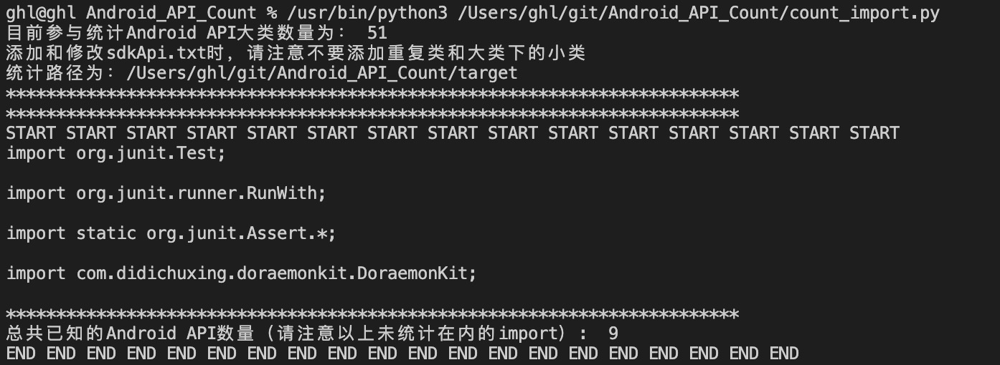

# README
___
## 环境：Python3
___
## 使用方法：
1. git clone https://github.com/rouxianmantou/Android_API_Count.git
2. cd Android_API_Count
3. 将要统计的包放到 /[your path..]/Android_API_Count/target下
4. python3 count_import.py
5. 输出如下图所示
6. 删除/[your path..]/Android_API_Count/target中的内容
___

